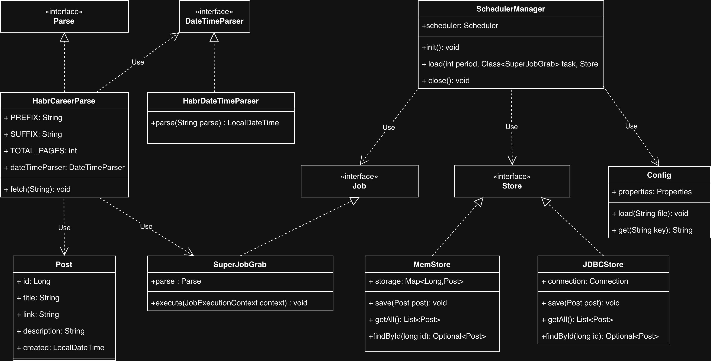

## Описание.

* **Система запускается по расписанию - раз в минуту. Период запуска указывается в настройках - app.properties.
  Первый сайт будет career.habr.com.**

* **Работаем с разделом: [Habr Career](https://career.habr.com/vacancies/java_developer)**

* **Программа должна считывать все вакансии c первых 5 страниц относящиеся к Java и записывать их в базу.**

---

---
### Технологии используемые в проекте:

- `Java 17`
- `Jsoup` - Парсинг Html
- `Quartz` - Планировщик задач
- `PostgreSQL` / `H2` - Хранение данных
- `Liquibase` - Управление миграцией БД.
- `Maven` - Сборка проекта.
- `log4j`  - Логирование.
- `JUnit` / `AssertJ` - Тестирование.
- `CheckStyle` - Проверка качества кода.

---

---

### 1. [Post](src/main/java/ru/grabber/model/Post.java)

**Класс Post** представляет модель данных, описывающую вакансию.

Он включает следующие поля:

•    `id`: `Long` — уникальный идентификатор вакансии.

•    `title`: `String` — название вакансии.

•    `link`: `String` — ссылка на страницу с вакансией.

•    `description`: `String` — описание вакансии.

•    `created`: `LocalDateTime` — дата и время публикации вакансии.

Этот класс содержит геттеры, сеттеры, а также переопределенные методы <u>equals() и hashCode()</u> для корректного
сравнения объектов.

### 2. [Config](src/main/java/ru/grabber/service/Config.java)

**Класс Config** предназначен для работы с конфигурацией приложения.

• Содержит поле `properties`: `Properties`, которое хранит параметры из конфигурационного файла.

### • Основные методы:

-    `load(String file)`: `void` — загружает свойства из указанного файла.

-   `get(String key)`: `String` — возвращает значение свойства по ключу.

<u>**Этот класс используется для настройки приложения, например, указания интервала работы парсера**.</u>

### 3. [Store](src/main/java/ru/grabber/stores/Store.java) (интерфейс)

**Интерфейс Store** - задает контракт для хранилища вакансий.

**• Методы:**

•    `save(Post post)`: `void` — сохраняет вакансию в хранилище.

•    `getAll()`: `List<Post>` — возвращает все сохраненные вакансии.

•    `findById(Long id)`: `Optional<Post>` — находит вакансию по идентификатору.

### 4. [MemStore](src/main/java/ru/grabber/stores/MemStore.java)

**Класс MemStore** - реализует интерфейс [Store](src/main/java/ru/grabber/stores/Store.java) и предоставляет хранилище в
памяти.

• **Использует коллекцию** - `storage`: `Map<Long, Post>` для хранения объектов.

• **Реализованные методы:**

- `save(Post post)`: `void` — добавляет вакансию в коллекцию.

- `getAll()`: `List<Post>` — возвращает список всех вакансий.

- `findById(Long id)`: `Optional<Post>` — находит вакансию по идентификатору в коллекции.

### 5. [JdbcStore](src/main/java/ru/grabber/stores/JdbcStore.java)

***Класс JdbcStore*** -  реализует интерфейс [Store](src/main/java/ru/grabber/stores/Store.java) для хранения данных в базе PostgreSQL.

• **Поле** `connection`: `Connection` используется для взаимодействия с базой.

***• Методы:*** 

- `save(Post post)`: `void` — сохраняет вакансию в базе данных.

- `getAll()`: `List<Post>` — извлекает все вакансии из базы.

- `findById(Long id)`: `Optional<Post>` — находит вакансию по идентификатору.

### 6.[Parse](src/main/java/ru/grabber/service/Parse.java)  (интерфейс)
   ***Интерфейс Parse*** -  описывает операции для парсинга данных с веб-сайтов. 
   
**• Метод:**

- `fetch(String link)`: `List<Post>` — возвращает список вакансий.

### 7. [HabrCareerParse](src/main/java/ru/grabber/service/HabrCareerParse.java)

***Класс HabrCareerParse*** -  реализует интерфейс [Parse](src/main/java/ru/grabber/service/Parse.java).

Используется для парсинга вакансий с платформы **[career.habr.com.](https://career.habr.com/)**
      
***• Поля:***

- `PREFIX`: `String` — префикс для ссылок на страницы с вакансиями.

- `SUFFIX`: `String` — параметры для фильтрации вакансий.

- `TOTAL_PAGES`: `int` - параметры количества страниц для парсинга вакансий

- `dateTimeParser`: `DateTimeParser` - объект для корректного парсинга даты и времени создания вакансии

• **Метод:** 

o `fetch(String link)` - загружает и обрабатывает HTML-страницы, извлекая данные о вакансиях.

### 8.[DateTimeParser](src/main/java/ru/grabber/utils/DateTimeParser.java)  (интерфейс)

- Интерфейс задает контракт для парсинга даты и времени создания заявки. 

**Методы:**
  
-  `parse(String parse)`: `LocalDateTime` - возвращает дату и время создания заявки

### 9.  [HabrDateTimeParser](src/main/java/ru/grabber/utils/HabrDateTimeParser.java)
   Класс реализует интерфейс [DateTimeParser](src/main/java/ru/grabber/utils/DateTimeParser.java). Используется для парсинга даты и времени создания вакансии.
   
**Метод:** 

- `parse(String parse)`: `LocalDateTime` - извлекает дату и время создания вакансии

### 10. [SchedulerManager](src/main/java/ru/grabber/service/SchedulerManager.java)

**Класс SchedulerManager**  - управляет задачами парсинга через библиотеку **<u>Quartz.</u>**

• **Поля:**

- `scheduler`: `Scheduler` — объект для управления расписанием задач.

• **Методы:**

- `init()`: `void` — инициализирует планировщик.

- `load(int period, Class<SuperJobGrab> task, Store store)`: `void` — создает и запускает задачу с указанным интервалом. 

- `close()`: `void` — завершает работу планировщика.

### 11. [SuperJobGrab](src/main/java/ru/grabber/service/SuperJobGrab.java)
Класс SuperJobGrab реализует интерфейс Job (из Quartz) и отвечает за выполнение задачи парсинга.

***• Поле:***

- `parse`: `Parse` — объект, реализующий логику парсинга.

***• Метод:***

- `execute(JobExecutionContext context)`: `void` — выполняет задачу парсинга и сохраняет данные через хранилище (Store).

### 12. [Main](src/main/java/ru/Main.java)

***Класс Main*** -  является точкой входа в приложение.

***• Основной метод:*** 

- `main(String[] args)`: `void` — настраивает приложение, запускает парсинг вакансий и сохраняет их в хранилище.

---

---
### Архитектурные связи

• `Post` - используется везде как основная модель данных.

• `Config` - загружает параметры для работы приложений.

• `Store`, `MemStore`, и `JdbcStore`  - обеспечивают хранение данных.

• `Parse` и `HabrCareerParse` - отвечают за извлечение вакансий.

• `Grab` и `SchedulerManager` - управляют периодическим запуском.

• `Main` - связывает все компоненты для работы приложения.

---

---
### Схема зависимостей проекта 

### 